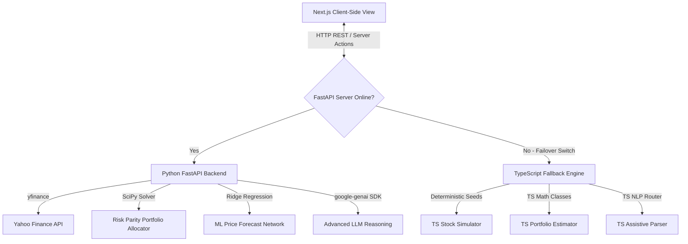

# QuantPulse: Full-Stack Algorithmic Trading Suite & Quantitative Research Terminal

**Sole Architect & Developer**: Shivam Kumar Singh ([shsaish006](https://github.com/shsaish006))

QuantPulse is a professional-grade quantitative stock analysis terminal. The platform provides equal-volatility risk parity portfolio construction, regularized machine learning price forecasting, dynamic strategy backtesting, and an automated conversational AI copilot. Designed to replace human emotional bias with systematic, rule-based algorithmic decision-making, the system operates as a fully decoupled full-stack architecture.

---

## 1. System Implementation Architecture

---

## 2. Core Subsystems: What, Why, and How

### 2.1 Volatility-Equalized Risk Parity Portfolio Optimization
*   **What It Is Used For**: This subsystem is used to construct balanced asset portfolios. It determines the optimal distribution of capital across any chosen basket of equities, commodities, and index ETFs.
*   **What It Accomplishes**: The allocator computes capital weights for each asset such that every asset contributes an identical amount of volatility to the overall portfolio. High-risk, high-volatility assets are assigned lower capital weights, while low-volatility, defensive assets receive higher capital weights. It also accounts for asset correlations, rewarding uncorrelated assets with higher weights due to their diversification benefits.
*   **Why I Made It**: Traditional asset allocation, such as the Markowitz Mean-Variance framework, relies heavily on forecasting expected asset returns. Return forecasts are notoriously unstable; a minor change in return estimates can yield radically different, highly concentrated portfolios that carry severe tail risk. Risk parity eliminates the unstable "expected returns" variable entirely, focusing exclusively on risk budgeting to create portfolios that are far more resilient during market stress events.
*   **How I Made It**: I built this by porting a non-linear constrained optimization pipeline. In the FastAPI backend, the system downloads one year of historical close prices, calculates daily percentage returns, and builds a covariance matrix. It then feeds this covariance matrix into a non-linear trust-region constrained solver inside SciPy. The solver minimizes variance difference boundaries to find the decision vector where risk contributions are equalized, which is then normalized into capital weights.

### 2.2 Autoregressive Machine Learning Time-Series Forecaster
*   **What It Is Used For**: This subsystem is used to predict the short-term directional trend and price path of an individual equity over a seven-day trading horizon.
*   **What It Accomplishes**: It generates rolling daily price projections for the next seven trading sessions, flanked by statistical upper and lower boundary bands. These boundary bands expand dynamically over the forecast window, visually representing the compounding error variance and growing uncertainty of the regression forecast over time.
*   **Why I Made It**: Financial markets are extremely noisy and standard linear regressions are highly prone to overfitting—meaning they capture random high-frequency noise instead of stable, recurring structural relationships. This leads to highly inaccurate out-of-sample predictions. I designed this forecaster using regularized Ridge regression. By introducing an L2 shrinkage penalty, the model dampens coefficient weights, actively suppressing noise and ensuring only robust price trends are captured.
*   **How I Made It**: I built this forecasting pipeline by structuring rolling historical close prices into five lag vectors (Lag 1 through Lag 5) and concatenating them with technical trend and momentum vectors (RSI, MACD, Bollinger Bands, and ROC). This multi-dimensional feature matrix is used to train a Scikit-Learn Ridge model. The system then executes an iterative rolling forecast: it predicts tomorrow's price, appends that prediction back into the dataset, re-calculates all technical lags, and slides the window forward to predict the subsequent session until the 7-day path is completed.

### 2.3 Copilot Interactive AI Directives System
*   **What It Is Used For**: This subsystem acts as a conversational control layer. It allows users to control the entire trading terminal using natural language commands rather than clicking menus or typing inputs manually.
*   **What It Accomplishes**: The AI Assistant interprets natural language queries (such as *"backtest Apple with leverage"* or *"optimize TSLA, MSFT, GLD"*) and responds with a detailed qualitative strategy report while simultaneously executing the requested action directly on the user interface. It auto-fills input fields, swaps tabs, and triggers calculations in the background.
*   **Why I Made It**: Modern financial dashboards are often overwhelming, requiring users to navigate complex sidebar toggles and sub-menus to perform basic operations. To create a seamless "Copilot" experience, I wanted an AI assistant that did not just explain quantitative theory in a textbox, but actively interacted with and controlled the terminal, bridging conversational AI with the client-side execution layer.
*   **How I Made It**: I designed an intelligent prompt pre-processor in the backend. When a chat message is received, the assistant parses the query for key intent markers and appends structured directives to the end of its response. On the client-side Next.js terminal, a regex parser intercepts the incoming messages. When a directive tag is detected, the terminal triggers a glassmorphic HUD notification overlay and routes the application state—updating search symbols, populating asset lists, switching active tabs, and triggering solvers automatically.

### 2.4 Support Desk Ticketing & Automated AI Diagnostic Resolver
*   **What It Is Used For**: This subsystem is an operational control center used to monitor, log, and resolve systemic anomalies, API timeouts, or quantitative model drifts in real-time.
*   **What It Accomplishes**: It establishes an active ticketing log where users can raise technical support tickets specifying category, severity, and details. Clicking "Resolve with AI" launches an inline, retro-styled hacker diagnostic console that runs a simulated step-by-step audit of the platform's equations and pipelines, providing detailed log traces before auto-resolving the ticket.
*   **Why I Made It**: Quantitative terminals rely on continuous, uninterrupted data feeds and stable solver convergence. When data drifts or APIs experience latency, standard applications crash silently. I made this subsystem to establish an interactive "ticket raise and resolve culture." It exposes the operational health of the system and makes troubleshooting an engaging, visual, and highly informative experience.
*   **How I Made It**: I implemented this by building a state-managed ticket ledger on the frontend. When the resolution sequence is triggered, the system locks user controls and initializes a hacker terminal log state. Using timed intervals, it prints diagnostic logging statements simulating checks on the FastAPI gateways, Ridge regression coefficients, cointegrating spread vectors, and solver constraints. Upon final validation, the terminal updates the ticket status to Resolved and releases the interface locks.

### 2.5 Visual Background Graphics & Live Aesthetics
*   **What It Is Used For**: This subsystem provides the visual styling and aesthetic environment for the trading terminal, creating a modern, premium workspace.
*   **What It Accomplishes**: It renders a solid pitch-black workspace background animated by **four massive, organic plasma orbs** of contrasting colors that float slowly across the screen, combined with a **reactive cursor spotlight** that follows the mouse with a glowing trail of light.
*   **Why I Made It**: Traditional financial software is visually uninspired, relying on standard dark modes or flat gray panels. To make the terminal feel exceptionally premium, alive, and interactive, I wanted to design background graphics that respond to the user's movements, creating an immersive, fluid "live session" feel.
*   **How I Made It**: I built an HTML5 Canvas engine mounted inside a global React component. The engine draws four massive radial gradient circles that drift across the screen using trigonometric sine and cosine waves. It tracks mouse coordinates to draw a cyan-purple-pink tri-color reactive spotlight trail that smoothly follows the cursor, while drawing sixty bubble particles that accelerate away from the cursor using electrostatic repulsion.

---

## 3. Algorithmic Strategy Goldmines Directory
QuantPulse includes a library of **fifty algorithmic trading strategies** across five distinct categories:
1.  **Trend Following**: Captures macro market momentum by filtering out high-frequency noise using moving average crossovers, Keltner ATR channels, and directional indexes.
2.  **Mean Reversion**: Capitalizes on temporary price extensions from historical averages using Relative Strength Index extremes, Bollinger Band squeezes, and oscillator pivots.
3.  **Statistical Arbitrage**: Exploits pricing gaps between historically correlated assets using cointegrated pairs trading spreads and ETF net asset value divergences.
4.  **Risk & Portfolio Math**: Controls downside risk and optimizes bankroll allocations using fractional Kelly bet sizing, value-at-risk limits, and constant proportion portfolio insurance.
5.  **Microstructure & Sentiment**: Capitalizes on short-term pricing imbalances by tracking bid-ask order book volume spreads and NLP-driven news sentiment drifts.

Each strategy card inside the Goldmines tab features a copyable, production-ready Python code block and an instant AI breakdown, allowing immediate quantitative review and testing.

---

## 4. Disclaimer and Operational Risk Notice
QuantPulse is designed solely for quantitative research, algorithmic backtesting simulations, and mathematical portfolio construction modeling. None of the calculated portfolio weights, regression projections, or AI copilot responses represent qualified financial, investment, or legal advice. All trade simulations assume frictionless execution parameters. Market volatility involves substantial loss hazards.
